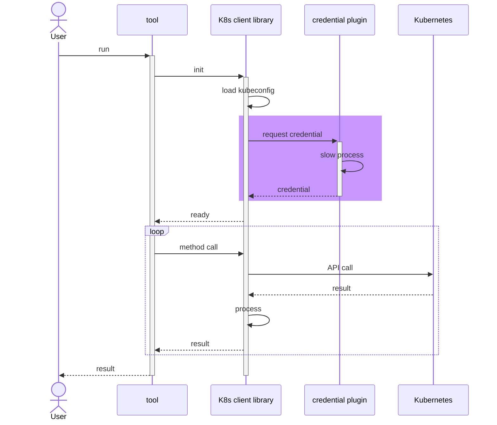
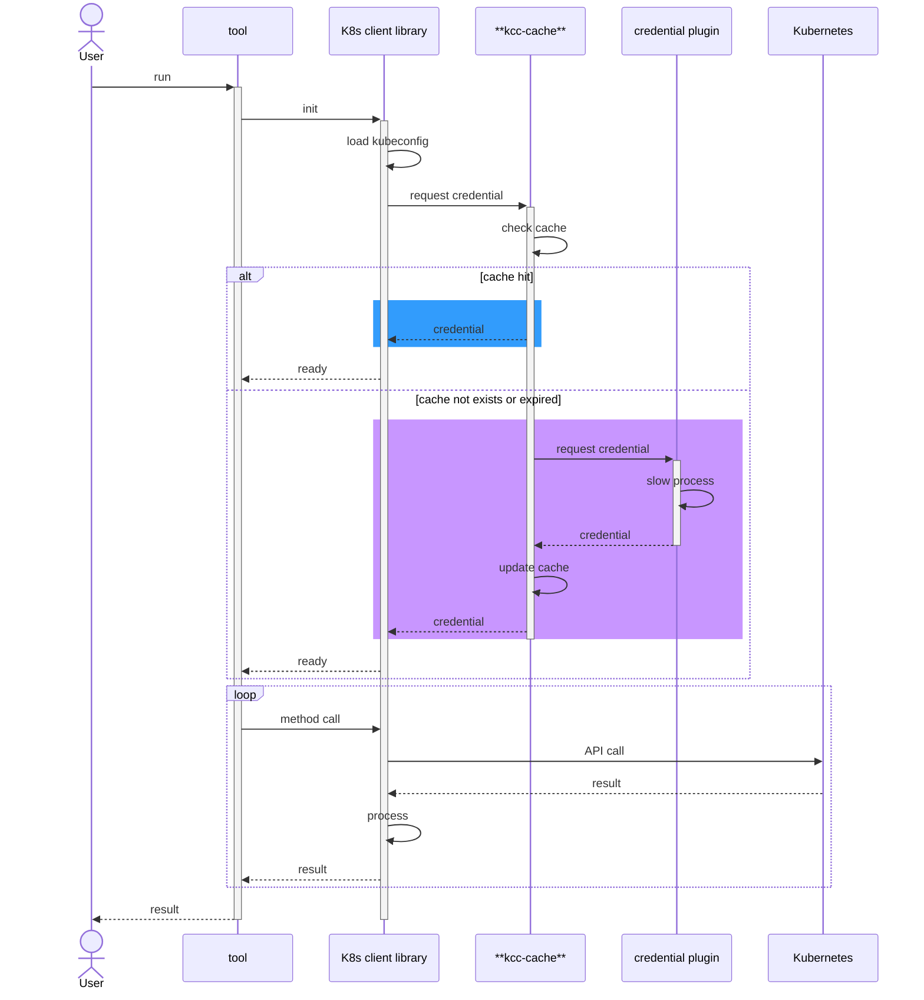

## Architecture

## Sequence

### Without kcc-cache

```mermaid
sequenceDiagram
    actor user as User
    participant tool
    participant client as K8s client library
    participant plugin as credential plugin
    participant k8s as Kubernetes

    user ->>+  tool: run
    tool ->>+  client: init
    client ->> client: load kubeconfig
    rect rgb(200, 150, 255)
      client ->>+ plugin: request credential
      plugin ->> plugin: slow process
      plugin -->>- client: credential
    end
    client -->> tool: ready
    loop
      tool ->> client: method call
      client ->> k8s: API call
      k8s -->> client: result
      client ->> client: process
      client -->> tool: result
    end
    tool -->> user: result

    deactivate client
    deactivate tool
```

### With kcc-cache

```mermaid
sequenceDiagram
    actor user as User
    participant tool
    participant client as K8s client library
    participant cache as **kcc-cache**
    participant plugin as credential plugin
    participant k8s as Kubernetes

    user ->>+  tool: run
    tool ->>+  client: init
    client ->> client: load kubeconfig
    client ->>+ cache: request credential
    cache ->> cache: check cache
    alt cache hit
      rect rgb(50, 156, 252)
        cache -->> client: credential
      end
      client -->> tool: ready
    else cache not exists or expired
      rect rgb(200, 150, 255)
        cache ->>+ plugin: request credential
        plugin ->> plugin: slow process
        plugin -->>- cache: credential
        cache ->> cache: update cache
        cache -->> client: credential
      end
      deactivate cache
      client -->> tool: ready
    end
    loop
      tool ->> client: method call
      client ->> k8s: API call
      k8s -->> client: result
      client ->> client: process
      client -->> tool: result
    end
    tool -->> user: result

    deactivate client
    deactivate tool
```
